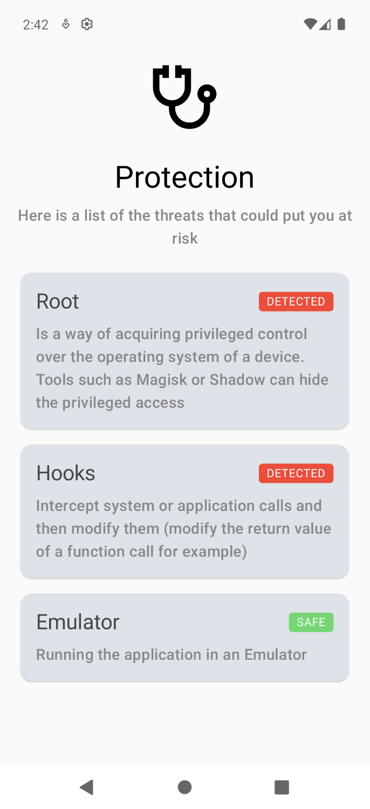

# Mobile Security Toolkit




In a world where mobile devices hold vast amounts of personal and
business-critical data, security is no longer optional — it's essential.

Security Suite is an open-source project designed to work on mobile security by
providing a developer-friendly, all-in-one repository for developers and
security experts.

## Features

Already implemented Features are:

- [x] Jailbreak or Root Detection
- [x] Hooks Detection
- [x] Simulator Detection
- [x] Device Passcode Check
- [x] Hardware Security Check
- [x] App Signature Check

You can see them in action with the [Example App](./example)
we've provided

## Installation

You can use the Mobile Security Toolkit in your project by importing it from
Maven Central

### Maven Central

`Not Available`

### Jitpack

See [Jitpack page](https://jitpack.io/#EXXETA/Android-Security-Toolkit)

Setup root `build.gradle.kts`:

```
dependencyResolutionManagement {
    repositoriesMode.set(RepositoriesMode.FAIL_ON_PROJECT_REPOS)
    repositories {
        google()
        mavenCentral()
        maven {
            name = "Jitpack"
            url = uri("https://jitpack.io")
        }
    }
}
```

Import in project `build.gradle.kts`:

```
dependencies {
    implementation("com.github.EXXETA:Android-Security-Toolkit:1.1.0")
}
```

## Usage

### Variable API

Use the gettable variables to get current status of the device:

- `Boolean get ThreatDetectionCenter.areRootPrivelegesDetected`
- `Boolean get ThreatDetectionCenter.areHooksDetected`
- `Boolean get ThreatDetectionCenter.isSimulatorDetected`

### Async Stream API

Use Async Stream API to get detected threats asynchronously:

```kotlin
// Create state
val reportedThreats = remember {
    mutableStateListOf<ThreatDetectionCenter.Threat>()
}

// Collect stream
LaunchedEffect(Unit) {
    detectionCenter.threats.collect {
        reportedThreats.add(it)
    }
}

// Read the threats:
reportedThreats.contains(ThreatDetectionCenter.Threat.ROOT_PRIVILEGES)
reportedThreats.contains(ThreatDetectionCenter.Threat.HOOKS)
reportedThreats.contains(ThreatDetectionCenter.Threat.SIMULATOR)

```

## Roadmap

Next features to be implemented:

- [ ] Debugger Detection
- [ ] Integrity Check

## Contributing

See [CONTRIBUTING](./CONTRIBUTING.md)

## Authors and acknowledgment

Authors:

- [Yessine Choura](https://github.com/ychoura)
- [Denis Dobanda](https://github.com/theDeniZ)

Special Thanks:

- Sabrina Geiger
- Dennis Gill
- Jonas Rottmann

Used Libraries:

- [RootBeer](https://github.com/scottyab/rootbeer)

## License

See [LICENSE](./LICENSE.md)
